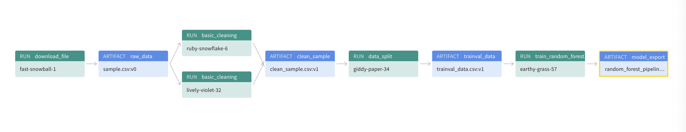

## Project 2: Build an ML Pipeline for Short-Term Rental Prices in NYC
The second project of [ML DevOps Engineer Nanodegree](https://www.udacity.com/course/machine-learning-dev-ops-engineer-nanodegree--nd0821) by Udacity. This project aims to help a property management company that rents rooms and properties for short periods of time on various rental platforms. The developed end-to-end reusable pipeline is utilized to estimate the typical price for a given property based on the price of similar properties, in a systematic approach for new data in bulk every week. 


### Project files
```
📦 P2-Build-ml-pipeline-for-short-term-rental-prices
 ┣ 📂 .github
 ┃  ┗ 📂 workflows
 ┃    ┗ 📜 main.yml               # Github Action yml file
 ┣ 📂 components                  # ~~~[ Components folder ]~~~
 ┃  ┣ 📂 get_data
 ┃  ┣ 📂 train_val_test_split
 ┃  ┗ 📂 wandb_utils    
 ┣ 📂 src                         # ~~~[ Main pipeline folder ]~~~
 ┃  ┣ 📂 basic_cleaning
 ┃  ┣ 📂 data_check
 ┃  ┣ 📂 data_split
 ┃  ┣ 📂 eda
 ┃  ┣ 📂 test_regression_model
 ┃  ┣ 📂 train_random_forest
 ┃  ┗ 📂 logs
 ┣ 📜 MLproject.yml              # Specifications of ML project  
 ┣ 📜 config.yml                 # Configuration file for ML Flow
 ┣ 📜 conda.yml                  # Configuration file for conda
 ┣ 📜 environment.yml            # Configuration file for Environment
 ┣ 📜 main.py                    # Main Script
 ┗ 📜 README.md   
```

### Usage

#### Create environment
Make sure to have conda installed and ready, then create a new environment using the ``environment.yml`` file provided in the root of the repository and activate it:
 ```bash
 > conda env create -f environment.yml
 > conda activate nyc_airbnb_dev
 ```

#### Build the pipeline
1. Start building the pipeline by running the following command:
 ```bash
 cd ./P2-Build-ml-pipeline-for-short-term-rental-prices
 >  mlflow run . 
 ```

2. Run the `download` pipeline's step to get a sample of the data and save it as `sample.csv` artifact on W&B:   
  ```bash
  > mlflow run . -P steps=download
  ```

3. Run the `basic_cleaning` pipeline's step to create a new artifact `clean_sample.csv` with the cleaned data:   
  ```bash
  > mlflow run . -P steps=basic_cleaning
  ```

4. Run the `data_check` pipeline's step to test and verify the cleaned dataset:   
  ```bash
  > mlflow run . -P steps=data_check
  ```

5. Run the `data_split` pipeline's step to extract and segregate the test dataset:   
  ```bash
  > mlflow run . -P steps=data_split
  ```

6. Run the `train_random_forest` pipeline's step to generate an inference pipeline for provided model and features:   
  ```bash
  > mlflow run . -P steps=train_random_forest
  ```

7. Run the `train_random_forest` pipeline's step again by sweeping different hyperparameters to train the model. Use `hydra/launcher=joblib` to enable parallel training.
  ```bash
  >mlflow run . -P hydra_options="-m hydra/launcher=joblib main.execute_steps=train_random_forest modeling.random_forest.max_features=0.1,0.33,0.5,0.75,1 modeling.max_tfidf_features=10,15,30"
  ```

8. Run the `test_regression_model` pipeline's step to test the best model against the test dataset and tag it with the "prod" tag:   
  ```bash
  > mlflow run . -P steps=test_regression_model
  ```


#### Visualize the pipeline:



The pipeline shows each component with its own input and output artifacts. These components together form the pipeline, which can be used for data preprocessing, model training, and evaluation.

* `download_file`: uploads data from a local path to W&B (Weights and Biases)
* `basic_cleaning`: undergoes cleaning and outlier handling  
* `data_check`: performs data validation, ensuring the dataset meets certain criteria
* `data_split`: Splits the dataset into two parts: trainval (training and validation data) and test.
* `train_model`: builds and trains a pipeline. It includes handling missing data, some feature engineering, modeling, and generating scoring results.
* `test_model`: Evaluates the saved pipeline on the test data by generating scoring results to assess the model's performance.


#### Testing the released pipeline

* Run the pipeline directly from Git Hub using a different sample of data ``:
 ```bash

  > mlflow run https://github.com/0xRYx0/P2-Build-ml-pipeline-for-short-term-rental-prices.git \
            -v [the version you want to use, like 1.0.0] \
            -P hydra_options="etl.sample='sample2.csv'"
  ```

**_NOTE_**: the file ``sample2.csv`` contains more data than ``sample1.csv`` so the training will
            be a little slower.


##### In case of errors
* To clean up all conda environments created by `mlflow`: 
 ```
 > conda info --envs | grep mlflow | cut -f1 -d" "
 > for e in $(conda info --envs | grep mlflow | cut -f1 -d" "); do conda uninstall --name $e --all -y;done
 ```
 **_NOTE_**: this will remove *ALL* the environments with a name starting with `mlflow`. Use at your own risk

* In case an error has been triggered with `wandb_internal_pb2` module, the protocol buffers used by wandb:
 1. Update the `protobuf` package to the latest version by running ``` pip install --upgrade protobuf ```
 2. Run command: ``` export PROTOCOL_BUFFERS_PYTHON_IMPLEMENTATION=python ```


#### License

Distributed under the [MIT](https://choosealicense.com/licenses/mit/) license. More in [License](LICENSE.txt)
